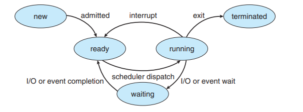

# A Brief Summary of CPU Scheduling
* overall goal is to practice 100% utilization of the CPU (no idle time)
* **CPU Burst** -- when the process is executing
* **I/O Burst** -- when the cpu is waiting for I/O

###Process States

## Scheduling Criteria
* **CPU utilization** — we want to keep the CPU as busy as possible (in reality usually ranges from 40% for a light load and up to 90% for a heavily used system)
* **Throughput** — a measure of processes completed per unit time (good CPU utilization means work is being done)
* **Turnaround time** — how long it takes to execute a process — from submission time to completion time
* **Waiting time** — the amount of time a process spends waiting in the ready queue (waiting for CPU and waiting time for I/O) but not the time when the processes is actually executing. An indication of how fast the scheduler is assigning the process to a CPU. Can be used to benchmark the scheduler algorithm (a bad scheduler algorithm will have lots of waiting time)
* **Response time** — in an interactive system, turnaround time may not be the most helpful criterion because it can be limited by the speed of the I/O device. Another measure is the time from the submission of a request until the first response is produced (the time it takes to start responding not to output the response)
	* Example: you want to watch a mp4 video file. You click it. It takes a moment to load. For you to see the video, it takes some time. When you clicked it, the process may have already executed, but there is a delay for seeing the output on our screen. We don’t want to measure the time for the response, we want to measure the time for the first response. Here the computer screen is an output device, but the response/process has already executed in the background

## Priority Scheduling

## Preemptive and Non-preemptive
* **preemptive scheduling** takes the process priority into account, so the CPU can be taken away from a process even when it is running (leads to potential problems with shared memory)
* **nonpreemptive** just runs the process until it is finished without interruptions (the processor has a clear decision to select a new process and the CPU is only taken away once the process is terminated)

